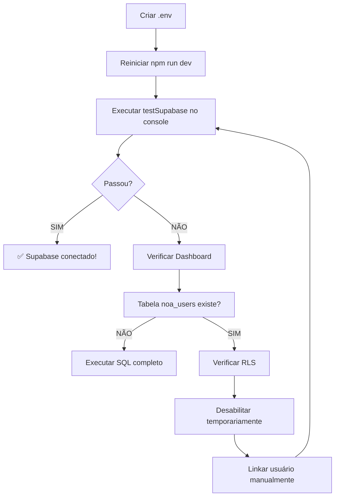

# 🔍 DIAGNÓSTICO COMPLETO - SUPABASE NÃO CONECTADO

## 🚨 ERRO ATUAL
```
⚠️ Perfil não encontrado, usando modo local: Error: Timeout profile
```

---

## 📋 CHECKLIST DE DIAGNÓSTICO

### ✅ PASSO 1: Verificar Variáveis de Ambiente

**No seu computador:**

1. Crie arquivo `.env` na raiz do projeto (mesma pasta que `package.json`)

2. Adicione estas linhas:
```env
VITE_SUPABASE_URL=https://lhclqebtkyfftkevumix.supabase.co
VITE_SUPABASE_PUBLISHABLE_KEY=cole_aqui_a_anon_key
```

3. **Onde pegar a ANON KEY?**
   - Acesse: https://supabase.com/dashboard/project/lhclqebtkyfftkevumix/settings/api
   - Copie: **Project API keys** → **anon** → **public**
   - Exemplo: `eyJhbGciOiJIUzI1NiIsInR5cCI6IkpXVCJ9...`

4. **Reinicie o servidor:**
```bash
# Ctrl+C para parar
npm run dev
```

---

### ✅ PASSO 2: Testar no Console do Navegador

1. Abra o app: http://localhost:3000
2. Aperte **F12** (abre DevTools)
3. Vá na aba **Console**
4. Digite e execute:

```javascript
testSupabase()
```

5. **Leia os resultados:**

#### ✅ Se tudo OK:
```
✅ TODOS OS TESTES PASSARAM!
```

#### ❌ Se houver erro:
```
❌ CONFIGURAÇÃO INVÁLIDA!
   📋 SOLUÇÃO: ...
```

---

### ✅ PASSO 3: Verificar no Supabase Dashboard

**Acesse:** https://supabase.com/dashboard/project/lhclqebtkyfftkevumix

#### A. Verificar Tabelas
1. **Table Editor** (barra lateral esquerda)
2. Procure: **noa_users**
3. **Se NÃO aparecer:**
   - Vá em **SQL Editor**
   - Cole todo o conteúdo de `noa_esperanza_system_supabase.sql`
   - Clique **Run**

#### B. Verificar Usuários
1. **Authentication** → **Users**
2. Veja se há usuários cadastrados
3. Se SIM, copie o **User ID** (UUID)

#### C. Verificar Linkagem
1. **SQL Editor**
2. Cole e execute:
```sql
SELECT 
    au.id as auth_id,
    au.email,
    nu.name,
    nu.user_type
FROM auth.users au
LEFT JOIN noa_users nu ON nu.user_id = au.id;
```

3. **Resultado esperado:**
   - Se mostrar dados: ✅ Está linkado
   - Se `name` e `user_type` forem NULL: ❌ Não está linkado

---

### ✅ PASSO 4: Criar/Linkar Usuário Manualmente

**Se você já tem conta autenticada mas sem perfil em noa_users:**

1. **SQL Editor** no Supabase
2. Cole e execute (substitua os valores):

```sql
-- 1. Ver seu User ID
SELECT id, email FROM auth.users WHERE email = 'seu@email.com';

-- 2. Copie o ID que apareceu acima e cole abaixo
INSERT INTO noa_users (user_id, user_type, name, profile_data)
VALUES (
    'COLE_SEU_USER_ID_AQUI', 
    'paciente',  -- ou 'profissional'
    'Seu Nome Completo',
    '{"email": "seu@email.com"}'::jsonb
)
ON CONFLICT (user_id) DO UPDATE
SET name = EXCLUDED.name;

-- 3. Confirmar
SELECT * FROM noa_users WHERE user_id = 'COLE_SEU_USER_ID_AQUI';
```

---

### ✅ PASSO 5: Desabilitar RLS (Temporariamente)

**Se estiver bloqueando acesso:**

```sql
-- APENAS PARA TESTE LOCAL!
ALTER TABLE noa_users DISABLE ROW LEVEL SECURITY;

-- Verificar
SELECT tablename, rowsecurity FROM pg_tables WHERE tablename = 'noa_users';
-- rowsecurity deve estar 'false'
```

⚠️ **LEMBRE-SE**: Reative depois em produção!

---

### ✅ PASSO 6: Testar Login pela Landing Page

1. **Acesse:** http://localhost:3000
2. Clique **"Começar Agora"**
3. Preencha:
   - Nome: Seu nome
   - Tipo: **Sou Paciente** ou **Sou Médico**
   - Email e Senha
4. **Cadastrar**
5. **Verificar no Supabase:**
   - SQL Editor: `SELECT * FROM noa_users ORDER BY created_at DESC LIMIT 1;`

---

## 🎯 FLUXO COMPLETO DE VERIFICAÇÃO



---

## 🆘 PROBLEMAS ESPECÍFICOS

### ❌ "URL: https://your-project.supabase.co"
**Problema**: `.env` não foi criado ou não está sendo lido  
**Solução**:
1. Confirme que `.env` está na **raiz** do projeto
2. Reinicie o servidor (`Ctrl+C` → `npm run dev`)
3. Verifique se não tem `.env.local` ou `.env.development` conflitando

### ❌ "Key: Não configurada"
**Problema**: ANON_KEY não foi copiada corretamente  
**Solução**:
1. Vá no Supabase Dashboard → Settings → API
2. Copie **todo** o conteúdo da ANON key
3. Cole no `.env` SEM aspas extras

### ❌ "Timeout profile"
**Problema**: Supabase demora muito ou não responde  
**Solução**:
1. Verifique sua internet
2. Teste: https://lhclqebtkyfftkevumix.supabase.co (deve abrir página Supabase)
3. Aumente o timeout em `AuthContext.tsx` (já está em 2000ms)

### ❌ "RLS blocking access"
**Problema**: Políticas de segurança bloqueando  
**Solução**:
```sql
ALTER TABLE noa_users DISABLE ROW LEVEL SECURITY;
```

### ❌ "No rows found"
**Problema**: Tabela vazia  
**Solução**: Cadastre-se pela Landing Page ou insira manualmente (Passo 4)

---

## 📞 COMANDOS DE EMERGÊNCIA

### Resetar tudo:
```bash
# 1. Limpar cache
rm -rf node_modules/.vite

# 2. Reinstalar
npm install

# 3. Reiniciar
npm run dev
```

### Verificar configuração atual:
```javascript
// No console do navegador (F12)
console.log('URL:', import.meta.env.VITE_SUPABASE_URL)
console.log('Key:', import.meta.env.VITE_SUPABASE_PUBLISHABLE_KEY?.substring(0, 30))
```

---

## ✅ CONFIRMAÇÃO FINAL

Você saberá que está tudo OK quando:

1. ✅ Console mostra: `✅ Perfil carregado de noa_users`
2. ✅ Sem erros de "Timeout profile"
3. ✅ testSupabase() passa todos os testes
4. ✅ Nôa reconhece seu nome no chat

---

**Precisa de mais ajuda? Execute `testSupabase()` no console e compartilhe o resultado! 💪**

